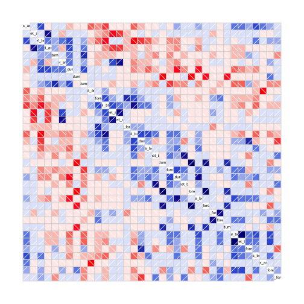

# Overview

We were asked to do an analysis of an extract of the [HAR](http://groupware.les.inf.puc-rio.br/har)
data set. We were told, the goal of this project is:

> predict the manner in which they did the exercise. This is the "classe" variable in the training set. You may use any of the other variables to predict with. You should create a report describing how you built your model, how you used cross validation, what you think the expected out of sample error is, and why you made the choices you did.

# Approach

First I downloaded the data from the website, and added it to my current working directory. I then
simply loaded it into R, taking care to not convert strings to factors, as browsing the site for this
data it was obvious that I was going to only care about the numeric columns.


```r
set.seed(1) #for reproducibility

pml.training <- read.csv("pml-training.csv", stringsAsFactors=FALSE)
pml.testing <- read.csv("pml-testing.csv", stringsAsFactors=FALSE)
```

Since my goal was to predict the classe column, and I want to create a one-vs-many cassification, I
go ahead and force that particular column to be a factor.


```r
pml.training$classe <- factor(pml.training$classe)
```

## Partitioning the Data

Before even fundamental exploration is done, I like to go ahead and partition my data set such
that I have a test set and a holdout set available to me for proper validation. I use caret's
createDataPartition function for this. First, we have to load caret


```r
library(caret)
```

And then I use two passes, first to extract the holdout set, and then to split the remainder set
into a test/train split.


```r
inTraining <- createDataPartition(pml.training$classe, p=.9, list=FALSE)
training.superset <- pml.training[inTraining,]
validation <- pml.training[-inTraining,]

inTesting <- createDataPartition(training.superset$classe, p=.25, list=FALSE)
training <- training.superset[-inTesting,]
testing <- training.superset[inTesting,]
```

# Basic Exploration

Viewing the names of this data frame, I saw that most of the axis variables ended in underscore
followed by X, Y or Z. I decided that for purposes of computational ease, rather than attempting 
to figure out what other values in the data frame (out of 160) had predictive capabilities, I simply
would extract the axis values, train a randomForest on them, and see if the accuracy was within my
desired levels for this assingment.


```r
axis <- grep("_[xyz]$", names(training))
y <- training$classe
x <- training[, axis]
```

In order to simply see if any dominant patterns arise in correlation, I do a simple corrgram
plot of all of the inputs into my proposed solution to see if anything sticks out.


```r
library(corrgram)
corrgram(x, order=TRUE)
```

 

While there are some spots of high correlation (both positive and negative), I don't believe that
there's anything that warns me that there's going to be an issue with this data.

## Training a Model

I picked a randomForest as it's one of the most trivial and high performant models available in R 
for the purposes of multi-label classification. We explicitly pick the trainControl method of oob
as it provides a more conservative sample with ensemble models like the randomForest (even though
it does not parallelize as well as repeatedcv or cv). For training purposes, I simply impute all NA's
to zero.


```r
x[is.na(x)] <- 0
fit.rf <- train(x, y, method="rf", trControl=trainControl(method="oob"))
```

## Validating the Model

Testing out this model on the test set gives us a relatively high performance.


```r
errorRate <- fit.rf$finalModel$err.rate[500]
testing[is.na(testing)] <- 0
matrix <- confusionMatrix(testing$classe, predict(fit.rf, testing))
```

The system gives us an accuracy of 0.9851 on the testing set.
With a 95% confidence interval between 0.981 and 
0.9884. The OOB estimate of error rate is 0.0132
as extracted from the err.rate parameter inside the randomForest object.

The actual confusion matrix shows that misclassifications are quite rare and the randomForest
predicts admirably:


```r
matrix$table
```

```
##           Reference
## Prediction    A    B    C    D    E
##          A 1255    0    0    1    0
##          B    9  841    5    0    0
##          C    0   16  750    4    0
##          D    0    0   22  701    1
##          E    0    0    3    5  804
```

When validated on our totally "held out" validation set, we get similar results:


```r
validation[is.na(validation)] <- 0
matrix  <- confusionMatrix(testing$classe, predict(fit.rf, testing))
```

The system gives us an accuracy of 0.9851 on the holdout set.
With a 95% confidence interval between 0.981 and 
0.9884.

## Creating Responses

In order to create response files for the final upload of the project, we simply
use the function provided in the assingment:


```r
pml_write_files = function(x){
  n = length(x)
  for(i in 1:n){
    filename = paste0("problem_id_",i,".txt")
    write.table(x[i],file=filename,quote=FALSE,row.names=FALSE,col.names=FALSE)
  }
}
```

And call it


```r
pml.testing[is.na(pml.testing)] <- 0;
pml_write_files(predict(fit.rf, pml.testing))
```
